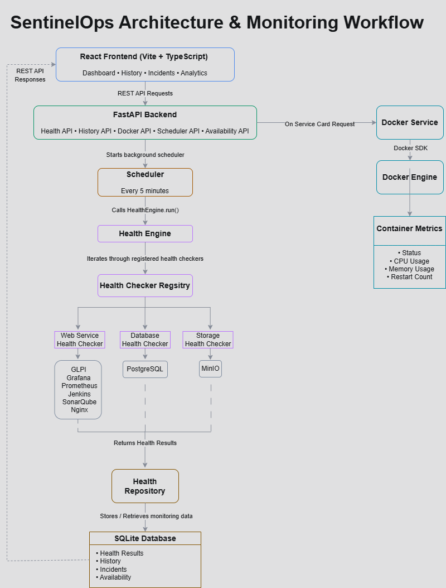

# SentinelOps

### Containerized Infrastructure Monitoring Platform

SentinelOps is a containerized infrastructure monitoring platform that continuously monitors the health, availability, and performance of services running in a Docker environment.

The platform performs scheduled health checks, records historical monitoring data, detects service incidents, collects Docker container metrics, and presents operational insights through a modern React dashboard.

Built using **FastAPI**, **React**, **Docker**, and **SQLite**, SentinelOps demonstrates practical DevSecOps concepts including infrastructure monitoring, observability, incident tracking, and container monitoring.

---

## Features

- Scheduled health checks every 5 minutes
- Service-specific health check implementations
- Historical health monitoring
- Incident detection and recovery tracking
- Service availability calculation
- Response time monitoring
- Docker container metrics
  - Container status
  - CPU usage
  - Memory usage
  - Restart count
- Interactive service cards
- Searchable dashboard
- Response time analytics
- Automatic refresh countdown
- SQLite-based historical storage
- Modern React + TypeScript frontend

---

## Architecture & Workflow



SentinelOps follows a layered monitoring architecture:

1. The React frontend communicates with the FastAPI backend through REST APIs.
2. A background scheduler executes every five minutes.
3. The Health Engine invokes all registered health checkers.
4. Each health checker validates its assigned service.
5. Health results are stored in SQLite.
6. Historical data is used to calculate incidents and availability.
7. Docker metrics are retrieved on demand using the Docker SDK.
8. Monitoring data is returned to the frontend for visualization.

---

| Dashboard | Service Details |
|-----------|-----------------|
|  |  |

| History | Incidents |
|---------|-----------|
|  |  |

### Response Time Analytics


---

## Technology Stack

| Layer | Technology |
|--------|------------|
| Frontend | React + TypeScript + Vite |
| Backend | FastAPI |
| Database | SQLite |
| Containerization | Docker & Docker Compose |
| Monitoring | Custom Health Engine |
| Charts | Recharts |
| Icons | Lucide React |

---

## Project Structure

```text
SentinelOps
│
├── backend
│   ├── api
│   ├── database
│   ├── health
│   ├── repository
│   ├── scheduler
│   ├── services
│   └── models
│
├── frontend
│   ├── components
│   ├── pages
│   ├── assets
│   └── styles
│
├── docs
│
├── docker-compose.yml
│
└── README.md
```

---

## Monitoring Workflow

```text
Scheduler
    │
    ▼
Health Engine
    │
    ▼
Health Check Registry
    │
    ├── Web Service Health Checker
    ├── Database Health Checker
    └── Storage Health Checker
            │
            ▼
      Health Results
            │
            ▼
    Health Repository
            │
            ▼
      SQLite Database
            │
            ▼
      REST API Responses
            │
            ▼
      React Dashboard
```

---

## REST API

| Endpoint | Description |
|----------|-------------|
| `/api/health` | Latest health status |
| `/api/history` | Historical monitoring data |
| `/api/incidents` | Incident history |
| `/api/availability` | Service availability |
| `/api/docker/container/{name}` | Docker container metrics |
| `/api/scheduler/status` | Scheduler status |

---

## Getting Started

### Clone the repository

```bash
git clone https://github.com/<your-username>/SentinelOps.git
cd SentinelOps
```

### Start the application

```bash
docker compose up --build
```

### Access the application

| Service | URL |
|---------|-----|
| Frontend | http://localhost:5173 |
| Backend API | http://localhost:8000 |
| Grafana | http://localhost:3000 |
| Prometheus | http://localhost:9090 |
| Jenkins | http://localhost:8080 |
| SonarQube | http://localhost:9000 |

---

## Future Enhancements

- Email and Slack alerting
- Authentication and role-based access control
- Kubernetes monitoring
- Configurable health check intervals
- Custom alert thresholds
- Prometheus metric export
- Notification integrations

---

## License

This project is licensed under the MIT License.
